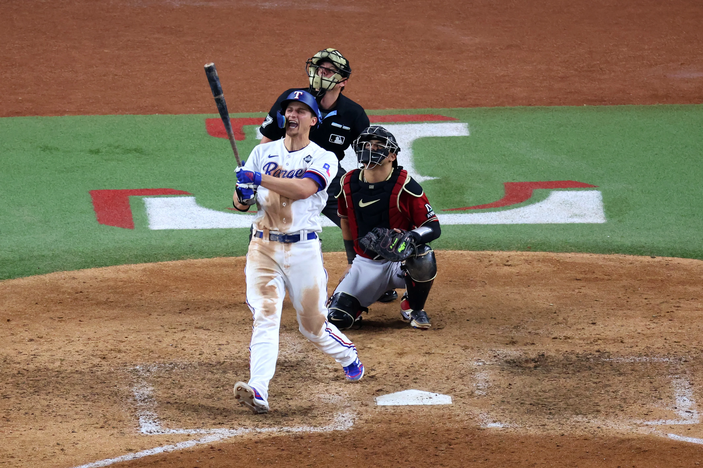

<h2> Hi, I'm Trevor Thrash! </h2>

<em>Master's in Financial Management at <a href="https://www.tamu.edu">Texas A&M University</a> Trading, Risk, and Investments</em>

### My current work:
- Developing advanced metrics for evaluating baseball pitches, including Stuff+ models and seam-shifted wake effects.
- Creating visualizations and analytics content for my Twitter audience [@BuntocoStats](https://twitter.com/BuntocoStats).
- [Writing articles and tutorials](https://trevorthrash.substack.com) on baseball analytics techniques.

### My toolbox:

	
	
	
	

### Connect with me:
The easiest way to connect with me is by sending a message on [Twitter](https://twitter.com/BuntocoStats) or via [email](mailto:trevor@buntocostats.com).

### Learn more:
You can learn more about me, my history, and my work by [visiting my personal website](https://trevorthrash.com).
